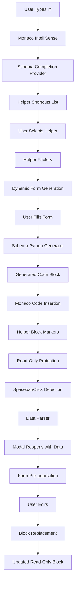

# System Architecture - Complete Component Flow

## 🎯 Overview

This guide shows **exactly how every piece connects** in the schema-driven helper modal system, from user input to code generation to Monaco integration.

## 🏗️ **Complete System Flow**



## 📦 **Core Components Architecture**

### **1. Schema Layer** 
```typescript
// o-ui/src/lib/editor/schemas/types.ts
interface UnifiedSchema {
  id: string
  name: string
  type: 'helper'
  helperUI: {
    fields: UIFieldSchema[]
    // ... form configuration
  }
  pythonGenerator: (variable: string, resultVar: string, params: any) => string
}
```

### **2. Schema Factory**
```typescript
// o-ui/src/lib/editor/schemas/factory.ts
export class SchemaFactory {
  static generateHelperUI(schema: UnifiedSchema) {
    return {
      fields: schema.helperUI.fields,
      onGenerate: (formData) => this.generate({
        schema,
        context: { helperParams: formData }
      })
    }
  }
}
```

### **3. Helper Factory Component**
```typescript
// o-ui/src/components/auto-generated/code-helper/helper-factory.tsx
export function HelperFactory({ 
  schema, 
  isOpen, 
  onClose, 
  onCodeGenerated,
  initialData // For editing existing helpers
}) {
  const form = useAutoForm(schema.helperUI.fields, initialData)
  
  const handleGenerate = () => {
    const result = SchemaFactory.generate({
      schema,
      context: { helperParams: form.data }
    })
    onCodeGenerated(result.code)
  }
}
```

### **4. Monaco Integration Component**
```typescript
// o-ui/src/components/editor/helpers/business-rules-editor-with-utility.tsx
export function BusinessRulesEditorWithUtility() {
  const [helperModal, setHelperModal] = useState(null)
  const editorRef = useRef()
  
  // Handle helper insertion
  const insertHelperCode = (code: string) => {
    const editor = editorRef.current
    const position = editor.getPosition()
    
    // Insert with helper markers
    const wrappedCode = wrapWithHelperMarkers(code, schema.id)
    editor.executeEdits('helper-insert', [{
      range: new monaco.Range(position.lineNumber, 1, position.lineNumber, 1),
      text: wrappedCode
    }])
    
    // Make block read-only
    markBlockAsReadOnly(editor, wrappedCode)
  }
}
```

## 🔄 **Data Flow Architecture**

### **Phase 1: Schema Registration**
```typescript
// 1. Schema Definition
const remarkHelper = {
  id: 'find-remark-helper',
  name: 'Add Vendor Remark',
  helperUI: { fields: [...] },
  pythonGenerator: (variable, resultVar, params) => generateCode(params)
}

// 2. Registration in Monaco
monaco.languages.registerCompletionItemProvider('business-rules', {
  provideCompletionItems: () => ({
    suggestions: SchemaFactory.generateMonacoCompletions(ALL_HELPER_SCHEMAS)
  })
})
```

### **Phase 2: User Interaction & Modal**
```typescript
// 3. User triggers helper
onUserSelectsHelper(helperId) {
  const schema = getSchemaById(helperId)
  setHelperModal({
    schema,
    mode: 'create',
    onGenerate: handleCodeInsertion
  })
}

// 4. Form generation
const formConfig = SchemaFactory.generateHelperUI(schema)
renderDynamicForm(formConfig)
```

### **Phase 3: Code Generation & Insertion**
```typescript
// 5. Code generation
const generateCode = (formData) => {
  const result = SchemaFactory.generate({
    type: 'helper',
    schema,
    context: { helperParams: formData }
  })
  return result.code
}

// 6. Monaco insertion with markers
const insertCode = (code) => {
  const wrappedCode = `
# HELPER_START:${schema.id}
${code}
# HELPER_END:${schema.id}
  `.trim()
  
  editor.executeEdits('helper-insert', [{
    range: selection,
    text: wrappedCode
  }])
}
```

### **Phase 4: Read-Only Protection**
```typescript
// 7. Block detection and protection
const isHelperBlock = (position) => {
  const model = editor.getModel()
  const line = model.getLineContent(position.lineNumber)
  return line.includes('HELPER_START') || 
         isInsideHelperBlock(position, model)
}

// 8. Prevent direct editing
editor.onWillEdit((e) => {
  if (e.edits.some(edit => isHelperBlock(edit.range.getStartPosition()))) {
    e.preventDefault()
    showReadOnlyMessage()
  }
})
```

## 🎮 **Monaco Editor Integration Points**

### **1. IntelliSense Integration**
```typescript
// o-ui/src/components/editor/language/schema-completion-provider.ts
export function createSchemaCompletionProvider() {
  return {
    provideCompletionItems: (model, position) => {
      const helpers = ALL_HELPER_SCHEMAS.map(schema => ({
        label: `🔧 ${schema.name}`,
        kind: monaco.languages.CompletionItemKind.Function,
        detail: schema.description,
        command: { 
          id: 'open-helper', 
          arguments: [schema.id] 
        }
      }))
      
      return { suggestions: helpers }
    }
  }
}
```

### **2. Event Handler Registration**
```typescript
// Register all helper-related event handlers
const setupHelperHandlers = (editor) => {
  // Spacebar activation
  editor.onKeyDown(handleSpacebarActivation)
  
  // Click activation  
  editor.onMouseDown(handleClickActivation)
  
  // Deletion detection
  editor.onDidChangeModelContent(handleContentChange)
  
  // Read-only enforcement
  editor.onWillEdit(handleEditAttempt)
}
```

### **3. Block Management System**
```typescript
// o-ui/src/components/editor/helpers/helper-block-manager.ts
export class HelperBlockManager {
  findHelperBlock(position: monaco.Position): HelperBlock | null
  extractHelperData(block: HelperBlock): Record<string, any>
  replaceHelperBlock(block: HelperBlock, newCode: string): void
  deleteHelperBlock(block: HelperBlock): void
  markBlockReadOnly(block: HelperBlock): void
}
```

## 🔧 **State Management Architecture**

### **Editor State**
```typescript
interface EditorState {
  helperBlocks: Map<string, HelperBlock>
  activeModal: HelperModalState | null
  readOnlyRanges: monaco.Range[]
  decorations: string[]
}
```

### **Helper Modal State**
```typescript
interface HelperModalState {
  schema: UnifiedSchema
  mode: 'create' | 'edit'
  initialData?: Record<string, any>
  sourceBlock?: HelperBlock
  onComplete: (code: string) => void
  onCancel: () => void
}
```

### **Helper Block State**
```typescript
interface HelperBlock {
  id: string
  schemaId: string
  range: monaco.Range
  markers: { start: monaco.Position; end: monaco.Position }
  data: Record<string, any>
  generatedCode: string
}
```

## 🔄 **Component Communication**

### **Parent → Child Data Flow**
```typescript
// BusinessRulesEditorWithUtility (Parent)
const [modalState, setModalState] = useState(null)
const [helperBlocks, setHelperBlocks] = useState(new Map())

// Passes to HelperFactory (Child)
<HelperFactory
  schema={modalState?.schema}
  initialData={modalState?.initialData}
  onCodeGenerated={handleHelperCodeGenerated}
  onClose={() => setModalState(null)}
/>
```

### **Child → Parent Communication**
```typescript
// HelperFactory calls parent callbacks
const handleFormSubmit = (formData) => {
  const code = generateCodeFromForm(formData)
  props.onCodeGenerated(code) // → Parent inserts into Monaco
  props.onClose() // → Parent closes modal
}
```

### **Monaco ↔ React State Sync**
```typescript
// Keep React state in sync with Monaco content
editor.onDidChangeModelContent((e) => {
  // Update helper block positions after content changes
  updateHelperBlockRanges(e.changes)
  
  // Detect helper block deletions
  detectDeletedHelperBlocks(e.changes)
  
  // Maintain read-only decorations
  refreshReadOnlyDecorations()
})
```

## 🎯 **Real Implementation Example**

### **Complete Flow in Action**
```typescript
// 1. User types 'if' → Monaco shows helpers
// 2. User selects 'Add Vendor Remark' helper
// 3. Modal opens with form fields
// 4. User fills: systems=['amadeus'], remark='TEST'
// 5. SchemaFactory generates Python code
// 6. Code inserted with helper markers
// 7. Block becomes read-only
// 8. User clicks inside block → Modal reopens with current data
// 9. User modifies: systems=['amadeus', 'galileo']
// 10. Block replaced with updated code
// 11. User deletes helper marker → Entire block deleted
```

This architecture provides **complete separation of concerns** while maintaining **tight integration** between all components. The schema drives everything, Monaco provides the editing experience, and React manages the UI state and interactions.

## 🚀 **Extension Points**

### **Adding New Helper Types**
1. Define schema in `schemas/helpers/`
2. Export in `helpers/index.ts`
3. System automatically picks up new helper
4. Works with all existing Monaco integration

### **Custom Field Types**
1. Add to `UIFieldSchema` type
2. Implement in `auto-form` component
3. Available in all helper forms

### **Advanced Block Behaviors**
1. Extend `HelperBlockManager`
2. Add custom decorations
3. Implement specialized editing modes

The system is **highly extensible** while maintaining **consistent behavior** across all helpers. 