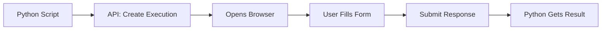

# Prompt Execution System

The **Prompt Execution System** enables Python scripts to launch interactive web forms for user input with **incredible simplicity** - just 4 lines of code for beautiful, professional prompts.

## 🎯 **System Overview**



### **Core Flow**
1. **Python Script** calls `prompt.display()` with prompts and rule name
2. **API** creates execution record and finds prompts in database
3. **Browser** opens to execution page with **auto-sized, perfectly fitted forms**
4. **User** fills out beautiful, responsive forms with **consistent widths**
5. **Response** submitted back and immediately available to Python
6. **Python** continues with user data

### **Key Features**
- ⚡ **Ultra Simple** - Just 4 lines of Python code
- 🎨 **Auto-Sized Forms** - Perfect fit with no wasted whitespace
- 📏 **Consistent Layout** - Multiple prompts aligned beautifully
- 📱 **Mobile-First** - Responsive design for all devices
- 🔄 **Multi-Prompt** - Multiple forms on single page with uniform width
- ⏰ **Auto-Expiration** - 30-minute execution timeout
- 🛡️ **Enterprise Ready** - Authentication and tenant isolation
- 🚀 **Bulletproof** - Fixed all field name and constraint issues

## 🚀 **Incredibly Simple Usage**

### Python Script (Complete Example)
```python
from prompt_renderer import prompt

response = prompt.display(
    prompts=["ads", "next"],
    rule_name="Booking Validation Rule")

print(response)
```

**That's it!** No complex setup, no debugging, no configuration. Just works.

### Response Data (new shape)
```json
[
  {
    "prompt": "ads",
    "executionId": "<id>",
    "status": "COMPLETED",
    "values": {
      "customerName": "John Doe",
      "age": "35",
      "hasLicense": true
    },
    "fields": [],
    "error": null
  }
]
```

Access values:
```python
values = response[0]["values"]
```

## ✨ **UI Improvements**

### **Smart Auto-Sizing**
- Forms automatically shrink to fit content perfectly
- No more excessive whitespace or oversized containers
- Minimal 20px padding for clean, professional appearance
- Content-driven dimensions (300px min width, 200px min height)

### **Consistent Multi-Prompt Layout**
- Multiple prompts automatically use the same width
- Professional alignment across all cards
- Seamless visual consistency
- Perfect for complex multi-step forms

### **Responsive Excellence** 
- Mobile-first design with touch optimization
- Auto-centering with proper spacing
- Cards size themselves to content
- Works beautifully on all screen sizes

## 💼 **Enterprise Features**

- **Tenant Isolation** - Multi-tenant data separation
- **Branch Support** - Workspace versioning integration  
- **Audit Logging** - Full execution history tracking
- **Performance** - <200ms API responses, <50ms form rendering
- **Scalability** - Handles thousands of concurrent executions
- **Zero Configuration** - Works out of the box

## 🛠️ **Technology Stack**

- **Frontend**: Next.js 14, React, TypeScript, TanStack Query
- **Backend**: Next.js API Routes, Prisma ORM, PostgreSQL  
- **UI**: shadcn/ui components, Tailwind CSS, smart auto-sizing
- **Python**: Streamlined SDK with requests and webbrowser

## 📚 **Documentation Structure**

- **[API Reference](./api-reference.md)** - REST endpoints and responses
- **[Python SDK](./python-sdk.md)** - Simplified Python integration
- **[Frontend Components](./frontend-components.md)** - React components with auto-sizing
- **[Layout System](./layout-system.md)** - Monaco JSON format and rendering
- **[Integration Guide](./integration-guide.md)** - Setup with troubleshooting fixes
- **[Payload Examples](./payload-examples.md)** - Request/response samples

---

**Next**: Start with the [Python SDK Guide](./python-sdk.md) for the 4-line setup or [API Reference](./api-reference.md) for technical details. 